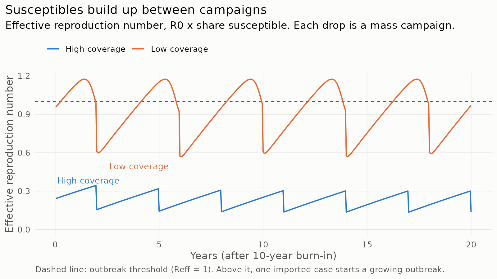
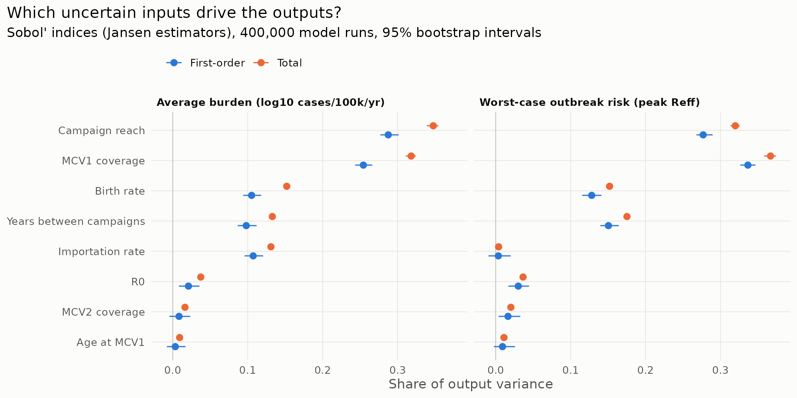

# Which uncertain inputs drive measles outbreak risk? A toy model with Sobol' sensitivity analysis

A small, self-contained exercise. It combines a simple measles transmission model with
variance-based (Sobol') sensitivity analysis to ask one question: **across plausible
ranges of vaccination, demographic and transmission inputs, which inputs actually drive
measles burden and outbreak risk?**

**Live interactive version:** https://ahmadbey678.github.io/measles-sobol/
(run the model with sliders and explore the Sobol' results in the browser).

This is a **toy model** built to learn the domain. It is not calibrated to any country and
its results are not policy advice. The assumptions and their limits are listed below.



## The model

A discrete-time model with two-week steps, roughly one measles generation.

- **Transmission:** Reed-Frost style. Each step, a susceptible person escapes infection
  with probability `exp(-R0 * I / N)`, where `I` includes imported infections.
- **Demography:** a constant population with births equal to deaths. The birth rate sets
  how fast new susceptible children enter.
- **Routine vaccination:** a newborn is protected if the first dose (MCV1) works, or if
  MCV1 failed and the second dose (MCV2) works. MCV1 effectiveness depends on age at
  vaccination, because maternal antibodies interfere in younger infants.
- **Mass campaigns (SIAs):** every few years, a share of the current susceptibles is
  vaccinated.
- Every parameter set is simulated simultaneously as a vector, so 400,000 runs take
  about 40 seconds in R.

Between campaigns, susceptibles accumulate and the effective reproduction number
(`Reff = R0 x share susceptible`) climbs. When it crosses 1, an imported case can start a
growing outbreak. This build-up and reset is the sawtooth in the figure above.

## Inputs and ranges

| Input | Range | Basis |
|---|---|---|
| R0 | 12 - 18 | Commonly cited range for measles; see Guerra et al. (2017) for the much wider spread in published estimates |
| Crude birth rate (per 1,000/yr) | 15 - 40 | Roughly spans low- to high-fertility countries |
| MCV1 coverage | 60% - 95% | Spans low- to high-coverage national programmes |
| MCV2 coverage (among MCV1 recipients) | 30% - 90% | Assumption |
| Age at MCV1 (months) | 9 - 12 | WHO-recommended schedule ages. Effectiveness interpolated from 77% (9-11 months) to 92% (12+ months), the medians in Uzicanin & Zimmerman (2011) |
| Years between campaigns | 2 - 5 | Typical campaign spacing |
| Campaign reach (share of susceptibles) | 20% - 80% | **Assumption.** Set lower than reported campaign coverage, because susceptible children are disproportionately the ones programmes miss |
| Imported infections (per million per 2 weeks) | 0.1 - 5 | **Assumption** |

Fixed: MCV2 effectiveness 95% among children whom MCV1 did not protect; campaign-dose
effectiveness 92%; 10-year burn-in followed by 20 recorded years.

## Outputs

1. **Average burden:** log10 of mean annual cases per 100,000 over the recorded years.
2. **Worst-case outbreak risk:** the peak `Reff` reached, measured just before campaigns,
   when susceptibles are highest.

## Sensitivity analysis

Sobol' indices estimated with the Jansen estimators (`sensitivity::soboljansen`),
N = 40,000 base samples (400,000 model runs), and 200 bootstrap replicates for 95%
intervals.

- **First-order index:** the share of output variance explained by that input alone.
- **Total index:** the same, plus everything it contributes through interactions with
  other inputs.



### What came out

- **MCV1 coverage and campaign reach dominate both outputs,** together accounting for
  roughly two-thirds of the variance.
- **The birth rate matters about as much as campaign spacing.** High-birth-rate settings
  refill the susceptible pool faster, so the same campaign schedule protects them less.
- **Importation matters for average burden but hardly at all for peak Reff.** This is
  expected: imports seed outbreaks but do not change how many people are susceptible.
- **MCV2 coverage and age at MCV1 barely register.** This is largely a consequence of the
  model's structure, not a finding about the real world:
  - MCV2 only reaches children who already received MCV1, so it only helps the minority
    for whom MCV1 failed. Where MCV2 is a second chance for children *missed* by MCV1, it
    would matter much more.
  - There is no age structure, so vaccinating at 12 rather than 9 months has no cost here.
    In reality, delaying the first dose leaves infants exposed for longer. The trade-off
    between that exposure and the higher effectiveness of a later dose is exactly what
    this model cannot see.
- The first-order indices sum to about 0.88 to 0.95, so interactions between inputs are
  present but modest.

### Cross-check

`python/crosscheck_salib.py` ports the model to NumPy and re-runs the analysis with SALib,
using a different sampler (a Sobol' sequence) and a different estimator implementation.
The ranking of inputs matches, and the indices agree to within about 0.01.

## Limitations

- No age structure, so there are no infant infections, no maternal immunity period and no
  age-targeted campaigns.
- Deterministic, with no spatial heterogeneity. Real immunity gaps are patchy, clustered
  by district and community.
- Campaigns reach susceptibles independently of routine vaccination. In reality, the same
  hard-to-reach children tend to be missed by both.
- Input ranges are plausible but not fitted to data. The Sobol' results describe this
  model under these ranges, and different ranges would give different indices.

## Natural next steps

1. Add age structure so the timing of the first dose has both a benefit and a cost.
2. Let MCV2 reach children missed by MCV1, and compare the indices.
3. Replace assumed ranges with ranges informed by serosurvey data.

## Run it

R 4.x plus two packages:

```r
install.packages(c("sensitivity", "ggplot2"))
```

```bash
Rscript R/run_analysis.R          # about 45 seconds; writes outputs/
pip install SALib numpy           # optional cross-check
python python/crosscheck_salib.py
node tests/check_js_port.js       # checks the browser model matches R
```

`R/run_analysis.R` also writes `docs/results.js`, so the web page always shows the
indices R computed. The page (`docs/index.html`) runs a JavaScript port of the model
(`docs/model.js`); `tests/check_js_port.js` confirms it reproduces the R output.

## Files

```
R/model.R                 model, input ranges, vectorised simulator
R/run_analysis.R          example scenarios, Sobol' analysis, figures
python/crosscheck_salib.py  independent SALib cross-check
outputs/                  figures and sobol_indices.csv
docs/                     GitHub Pages site: index.html, model.js, results.js
tests/check_js_port.js    checks the JavaScript model against R
```

## References

- Guerra FM, et al. (2017). The basic reproduction number (R0) of measles: a systematic
  review. *Lancet Infectious Diseases* 17(12): e420-e428.
- Uzicanin A, Zimmerman L. (2011). Field effectiveness of live attenuated
  measles-containing vaccines: a review of published literature. *Journal of Infectious
  Diseases* 204(Suppl 1): S133-S148.
- Jansen MJW. (1999). Analysis of variance designs for model output. *Computer Physics
  Communications* 117: 35-43.
- Saltelli A, et al. (2010). Variance based sensitivity analysis of model output. Design
  and estimator for the total sensitivity index. *Computer Physics Communications* 181:
  259-270.
